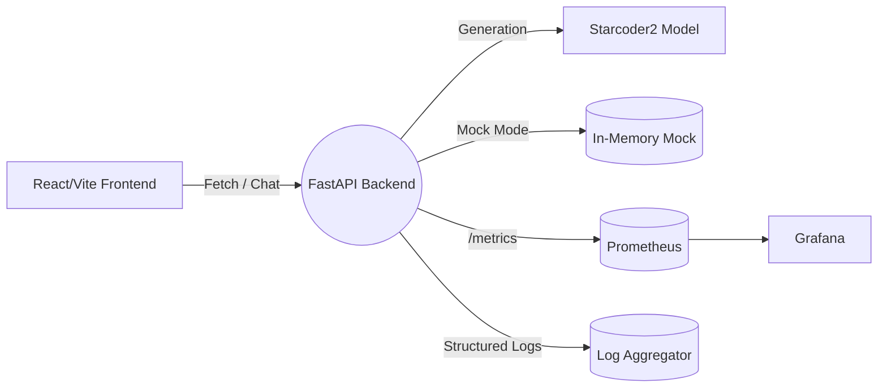

# KnoksPix – AI-Powered Image & Code Companion


[](https://knoksen.github.io/knoksPix/)
[](https://github.com/knoksen/knoksPix/actions/workflows/smoke.yml)
[](https://github.com/knoksen/knoksPix/actions/workflows/ci-cd.yml)
[](https://github.com/knoksen/knoksPix/issues)
[](https://github.com/knoksen/knoksPix/commits/main)
[](https://github.com/knoksen/knoksPix)
[](https://github.com/knoksen/knoksPix)
[](#preview-deployments)
[](LICENSE)
[](#backend-api-service-starcoder2)
[](#backend-api-service-starcoder2)
[](#frontend)
[](#testing)
[](#testing)

KnoksPix is an AI-first creative workspace combining:

* Intelligent image editing & adjustment workflow
* Generative augmentation via Gemini / (optional) local Starcoder2 backend
* Cross‑platform delivery (Web + Desktop [Electron] + Mobile [Capacitor/Android])
* Extensible architecture (pluggable model backends & tools)

Demo: View the app in [AI Studio](https://ai.studio/apps/drive/1BnuoY8eIUha7OgIXQ2xV93nn2hEKsfHT)

---

## Table of Contents

1. [Core Features](#features)
2. [Screenshots](#screenshots)
3. [Quick Start](#quick-start)
4. [Frontend](#frontend)
5. [Backend API (Starcoder2)](#backend-api-service-starcoder2)
6. [Deployment Options](#deployment-options)
7. [Preview Deployments](#preview-deployments)
8. [Environment Variables](#environment-variables)
9. [Testing](#testing)
10. [Architecture](#architecture)
11. [Security](#security)
12. [Release Checklist](#release-checklist)
13. [Contributing](#contributing)
14. [License](#license)

## Features

| Area | Highlights |
|------|-----------|
| Image Editing | Crop, filters, adjustment panel, object layer cards |
| AI Integration | Gemini API for generation (pluggable) |
| Local LLM Option | Optional Starcoder2 backend with SSE streaming, OpenAI-compatible endpoint |
| Performance | Vite + React + Code-splitting |
| Cross Platform | Web, Electron desktop builds, Android (Capacitor) |
| Tooling | Jest tests, GitHub Actions smoke & CI, PR preview deploys |
| Observability | Prometheus metrics, structured logging (backend) |
| Rate Limiting | SlowAPI sliding window on backend |

---

## Screenshots

| Editor Canvas | Filters Panel | Mobile View |
|---------------|--------------|-------------|
|  |  |  |

> Provide real screenshots: place PNGs in `docs/` named as referenced above. Keep width < 1600px for repo size hygiene.

> Remove this note after replacing placeholders.

---

## Quick Start

### Frontend Only (using hosted Gemini)

```bash
git clone https://github.com/knoksen/knoksPix.git
cd knoksPix
npm ci
echo "GEMINI_API_KEY=your_key" > .env.local
npm run dev
```

Open <http://localhost:5173>

### Full Stack (with local Starcoder2 backend)

```bash
cp backend/.env.sample backend/.env
# Edit backend/.env as needed (MODEL_ID, tokens, mock mode etc.)
docker compose up --build
# Frontend (separate terminal)
npm run dev
```

Backend API docs: <http://localhost:8000/docs>

---

## Frontend
React + TypeScript + Vite. Core UI elements in `components/`. State is localized per panel keeping bundle size lean. Tests under `tests/` use Jest + React Testing Library.

Build production bundle:

```bash
npm run build
```

Serve locally:

```bash
npm run preview
```

---

## Backend API Service (Starcoder2)
Located in `backend/`. Provides:

* `POST /v1/chat/completions` – OpenAI-style (stream or non-stream)
* `POST /v1/generate` – Simple prompt generation (stream or non-stream)
* `GET /metrics` – Prometheus metrics
* `GET /healthz` – Liveness check

Streaming uses Server-Sent Events (SSE). Chat endpoint emits OpenAI-compatible `chat.completion.chunk` objects. Generation endpoint emits `{ "text": "..." }` chunks then `[DONE]` sentinel.

Mock Mode (no model download): set `USE_MOCK_GENERATION=1`.

### Backend Setup

```bash
cd backend
python -m venv .venv && source .venv/bin/activate  # Windows: .venv\\Scripts\\activate
pip install -r requirements.txt -r requirements-dev.txt
cp .env.sample .env  # edit values
uvicorn main:app --reload --port 8000
```

### Configuration Reference

| Variable | Purpose | Default |
|----------|---------|---------|
| `MODEL_ID` | HF model id to load | `bigcode/starcoder2-3b` |
| `HF_TOKEN` | (Optional) auth for private models | empty |
| `STARCODER2_API_TOKEN` | Bearer token required by clients | `changeme` |
| `USE_MOCK_GENERATION` | Skip model load; return synthetic outputs | `0` |
| `MAX_NEW_TOKENS_LIMIT` | Hard upper bound user requests | `512` |
| `RATE_LIMIT` | slowapi rate expression | `100/minute` |
| `LOG_LEVEL` | Logging threshold | `INFO` |

### Streaming Protocol Details

Chat endpoint (`/v1/chat/completions`, `stream=true`):

```text
data: {"id":"...","object":"chat.completion.chunk","choices":[{"delta":{"content":"def"}}]}
data: {"id":"...","object":"chat.completion.chunk","choices":[{"delta":{"content":" add"}}]}
data: {"id":"...","object":"chat.completion.chunk","choices":[{"delta":{}}],"finish_reason":"stop"}
data: [DONE]
```

Generate endpoint (`/v1/generate`, `stream=true`):

```text
data: {"text":"partial token"}
data: {"text":" more"}
data: [DONE]
```

Both endpoints send `text/event-stream; charset=utf-8` and can be consumed with any SSE client. Non‑stream mode aggregates full text in a single JSON object.

### Observability

Metric names (Prometheus):

* `http_requests_total` / latency histograms (instrumentator defaults)
* Custom counters (planned): token usage per request (placeholder if not yet present)

Dashboards: Point Grafana at the Prometheus service (see `docker-compose.yml`).

### Performance Notes

* Use mock mode in CI to avoid multi‑GB model pulls.
* For GPU: extend Dockerfile build args (CUDA / ROCm) and launch with `--gpus=all` (already hinted in compose).
* Adjust `MAX_NEW_TOKENS_LIMIT` to guard latency & memory.
* Consider swapping to a `TextIteratorStreamer` for finer token pacing (roadmap).

Example (chat streaming):

```bash
curl -N \
   -H "Authorization: Bearer $STARCODER2_API_TOKEN" \
   -H "Content-Type: application/json" \
   -d '{
      "model": "bigcode/starcoder2-3b",
      "messages": [{"role":"user","content":"Write a Python hello world"}],
      "stream": true
   }' \
   http://localhost:8000/v1/chat/completions
```

Example (generate streaming):

```bash
curl -N \
   -H "Authorization: Bearer $STARCODER2_API_TOKEN" \
   -H "Content-Type: application/json" \
   -d '{
      "prompt": "def add(a,b):\n    return a+b",
      "max_new_tokens": 64,
      "stream": true
   }' \
   http://localhost:8000/v1/generate
```

### Python Helper Client

```python
from starcoder2_client import ChatClient
client = ChatClient(base_url="http://localhost:8000", token="changeme")
resp = client.chat([{ "role": "user", "content": "Write a Python function add(a,b)." }])
print(resp["choices"][0]["message"]["content"])
```

---

## Deployment Options

| Target | Method | Notes |
|--------|--------|-------|
| GitHub Pages (Frontend) | Automatic via `preview-gh-pages.yml` | Production build on main |
| PR Previews | Surge (auto) | Unique URL per PR comment |
| Docker (Backend) | `docker compose up --build` | GPU optional (see build args) |
| Electron Desktop | Prebuilt artifacts under `releases/` | Uses same React bundle |
| Android (Capacitor) | `npx cap sync android && open Android Studio` | Native packaging |
| Local Mock Backend | `USE_MOCK_GENERATION=1` | Fast dev / CI |

### One‑Click / Clone Deploy Buttons (Frontend)

| Platform | Button | Free Tier Notes |
|----------|--------|-----------------|
| Netlify | [](https://app.netlify.com/start/deploy?repository=https://github.com/knoksen/knoksPix) | Generous free bandwidth |
| Vercel | [](https://vercel.com/new/clone?repository-url=https://github.com/knoksen/knoksPix) | Serverless functions & previews |
| Render (Static) | [](https://render.com/deploy) | Add static site, set build `npm run build` output `dist` |
| Railway | [](https://railway.app/new) | Can host backend container + static |
| GitHub Pages | (Built-in) | Already configured |

### Backend Container Hosting Suggestions

| Host | Type | Free Tier Viability | Notes |
|------|------|---------------------|-------|
| Railway | Container | ✅ | Easy variables & volume mounts |
| Render | Container | ✅ (limited) | Auto redeploy on push |
| Fly.io | Firecracker VM | ✅ | Add GPU not free; good for small CPU model/mock |
| Docker Hub | Image Registry | ✅ | Push then run elsewhere |
| Local GPU | Bare Metal / WSL2 | ✅ | Use build args for CUDA/ROCm |

### Cost / Choice Matrix (Frontend Only)

| Requirement | Best Choice | Rationale |
|-------------|------------|-----------|
| Easiest zero-config | Vercel | Auto previews + analytics |
| Custom headers / redirects | Netlify | `_headers` & `_redirects` support |
| Combine FE + simple backend | Railway | One project multi-service |
| Static only, Git-based | GitHub Pages | Already shipping |

Badges / Buttons (add provider badges as you integrate):

[](https://github.com/knoksen/knoksPix/actions)
[](#backend-api-service-starcoder2)
[](#backend-api-service-starcoder2)

---

## Preview Deployments

* Each PR triggers a build + Surge deployment.
* A unique URL is commented automatically on the PR.
* Main branch builds to GitHub Pages (frontend) + can trigger backend container build (optional pipeline extension).

## Environment Variables

Frontend (`.env.local`):

```env
GEMINI_API_KEY=your_key
VITE_API_BASE=http://localhost:8000
```

Backend (`backend/.env`): (see `backend/.env.sample` for full list)

```env
MODEL_ID=bigcode/starcoder2-3b
STARCODER2_API_TOKEN=changeme
USE_MOCK_GENERATION=1
RATE_LIMIT=100/minute
MAX_NEW_TOKENS_LIMIT=512
LOG_LEVEL=INFO
```

---

## Testing
Run UI tests:

```bash
npm test
```

Backend tests (mock mode):

```bash
pytest
```

---

## Architecture


* Rate limiting: slowapi sliding window
* Streaming: SSE for both chat + generate
* Metrics: latency, request counts, token counter
* Multi-platform packaging: Electron + Capacitor

---

## Security
* Secrets only via environment variables
* Bearer token auth on backend when token set
* Rate limiting enabled by default
* No secrets shipped in PR preview builds

---

## Release Checklist

| Item | Status | Notes |
|------|--------|-------|
| README updated | ✅ | Current file |
| License present | ✅ | MIT license in repo |
| Env samples | ✅ | `backend/.env.sample` |
| CI smoke tests | ✅ | `smoke.yml` badge passing |
| PR preview pipeline | ✅ | Surge deployment configured |
| Backend health endpoint | ✅ | `/healthz` present |
| Metrics endpoint | ✅ | `/metrics` (Prometheus) |
| Rate limiting | ✅ | slowapi configured |
| Streaming verified | ✅ | SSE implemented both endpoints |
| Mock mode | ✅ | `USE_MOCK_GENERATION=1` |
| Image assets | ⚠️ | Replace placeholder screenshots |
| Deployment buttons | ✅ | Added Netlify/Vercel/etc |
| Backend tests | ✅ | Mock mode tests present |

## Run Locally (Frontend)

**Prerequisites:**  Node.js 20 or higher

1. Clone the repository:

   ```bash
   git clone https://github.com/knoksen/knoksPix.git
   cd knoksPix
   ```

2. Install dependencies:

   ```bash
   npm ci
   ```

3. Set up environment variables:
   * Create a `.env.local` file in the root directory
   * Add your Gemini API key: `GEMINI_API_KEY=your_api_key_here`

4. Start the development server:

   ```bash
   npm run dev
   ```

5. Open [http://localhost:5173](http://localhost:5173) in your browser

### Local Backend + Frontend Together

1. Start backend (mock for speed):

   ```bash
   (cd backend && USE_MOCK_GENERATION=1 uvicorn main:app --port 8000)
   ```

2. Start frontend:

   ```bash
   npm run dev
   ```

3. Set `VITE_API_BASE=http://localhost:8000` in `.env.local` if calling backend.

 
### Deployment

See [Deployment Options](#deployment-options) for matrix. Production frontend is emitted to `dist/`.

 
## License

MIT. See [`LICENSE`](LICENSE).

## Contributing

1. Fork the repository
2. Create a feature branch: `git checkout -b feat/awesome`
3. Commit: `git commit -m 'feat: add awesome capability'`
4. Push: `git push origin feat/awesome`
5. Open a Pull Request – preview URL will be auto‑attached.

Conventional commit prefixes (`feat:`, `fix:`, `docs:`) encouraged. Small, focused PRs merge faster.
